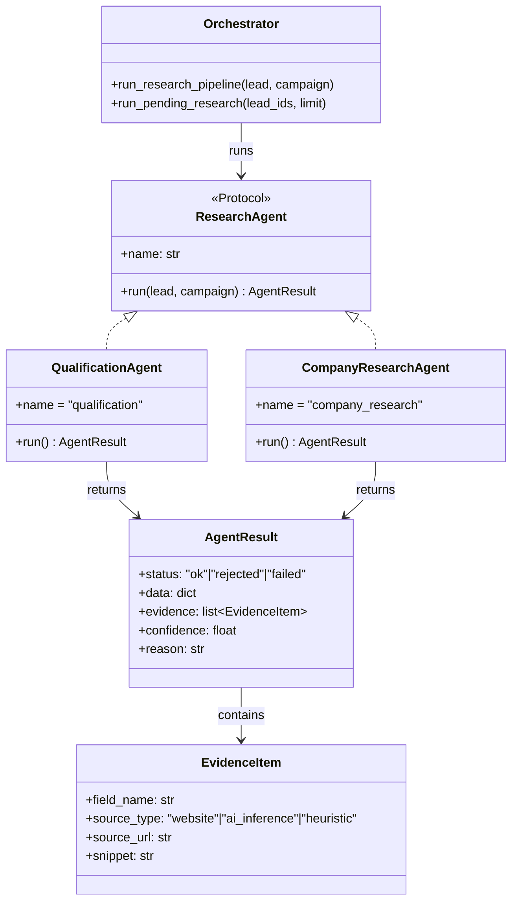

# AI Architecture Overview

**Companion to:** `ARCHITECTURE.md` §7. This document describes the current state of the AI agent framework and the principle governing its growth — it does not pre-design capabilities no agent needs yet.

## 1. Current State (already built, prior session)

`backend/intelligence/` is a real, working proto-framework, not a script collection:

What this already gives every agent, today, for free:

- A common contract (`ResearchAgent` protocol) — any new agent implementing `name` + `async run(lead, campaign) -> AgentResult` slots into the orchestrator with no orchestrator changes.
- Structured output (`AgentResult` — status/data/evidence/confidence/reason, not a free-form string).
- Evidence tracking with source attribution (heuristic vs. website content vs. AI inference) — nothing is presented as more certain than it is.
- A resumable, progressively-persisting orchestrator — a crash mid-pipeline doesn't lose completed work.
- Never-raises-out-of-`.run()` as an enforced contract (every existing agent catches its own exceptions and returns a `"failed"` `AgentResult` instead of propagating).
- Shared LLM dispatch (`ai_brain._call_llm_raw`/`_ollama_cfg`) — no agent calls a provider SDK directly or hardcodes a provider's request shape.

## 2. Growth Principle: Extract From Real Agents, Not Ahead of Them

The long-term framework needs to eventually support prompt management, structured I/O, tool execution, context management, shared memory, validation, retry policies, observability, metrics, cost/token tracking, and background execution — for agents like Lead Hunter, Decision Maker Discovery, Contact Verification, Competitor Research, SEO Audit, Outreach Writer, Follow-up Manager, CRM Assistant, Marketing Strategist, Proposal Generator, and Analytics Advisor.

None of that is built speculatively. The rule: **a capability is extracted into the shared framework once it's needed the same way by at least two or three real agents** — not designed upfront for agents that don't exist yet. This is a deliberate application of principle 9 (YAGNI over speculative generality) from `ARCHITECTURE.md`, and it's the direct answer to "don't build AI features as isolated scripts": the current two agents already prove the base contract works for more than one implementation, which is exactly the evidence a framework should be grown from.

## 3. Target Capability Surface

Every capability below will eventually exist. This table is the map of *what*, not a build schedule (that's `ROADMAP.md`, once agent work is prioritized) — it exists so every future agent is built against a consistent long-term shape, per your explicit requirement, without any of it being built before it's needed.

| Capability | State today | Emerges when... |
|---|---|---|
| Structured output contract | **Built** (`AgentResult`) | — |
| Evidence/source tracking | **Built** (`EvidenceItem`) | — |
| Shared LLM dispatch | **Built** (`ai_brain`) | — |
| Resumable orchestration | **Built** (progressive persistence) | — |
| Prompt management | Ad hoc (`_build_research_prompt`-style local functions) | A 2nd/3rd agent's prompt-construction logic converges on a shared pattern (versioning, templating) worth centralizing |
| Structured input validation | Partial (`CompanyResearchAgent`'s field coercion, added after a real bug) | Two agents need the same input-shape guarantees |
| Tool execution (agent calling external functions/APIs mid-run, beyond the current fixed fetch→LLM→persist shape) | Not needed yet — no current agent needs to dynamically choose tools | The first agent that needs to (e.g., Decision Maker Discovery deciding whether to check LinkedIn vs. a company's own team page) |
| Context management (multi-turn, long-running agent state beyond one `run()` call) | Not needed — every agent today is single-shot per lead | An agent needs to reason across multiple calls/steps, not one fetch-and-synthesize pass |
| Shared memory (cross-agent or cross-run recall) | Not needed | Two agents need to read each other's prior findings beyond what's already in `company_profiles`/`research_evidence` |
| Retry policies | Ad hoc (agents degrade gracefully on failure rather than retrying) | A real failure mode shows retrying (vs. degrading) is the right response |
| Observability / tracing | Basic (`logger.warning`/`logger.debug` per agent) | Milestone 7 (structured logging) gives every module this, agents included — no agent-specific work needed beyond adopting the shared logger |
| Cost/token tracking | Not built | The first agent using a paid cloud LLM in production (today's Ollama-default path has no per-token cost) |
| Background execution | **Built** (`run_pending_research`, orchestrator) | — |
| Permissions (what an agent is allowed to touch/spend) | Not built | An agent gains the ability to take an action with real-world side effects beyond reading/writing its own tables (e.g., sending a message autonomously) |

## 4. Relationship to Sales Intelligence Sub-projects 2–6

The already-planned remainder of the Sales Intelligence Engine (ICP Match + Sales Intelligence scoring, AI Personalization, Decision Maker Discovery, Contact Verification — see `project_saas_transformation` memory) is exactly where this framework grows next. Each of those sub-projects both delivers its own feature *and* is a data point for which shared capability (§3) is actually needed next. Decision Maker Discovery in particular is flagged in its own prior design spec as compliance-sensitive (LinkedIn ToS) — its scope needs re-discussion before it starts, independent of this architecture.
