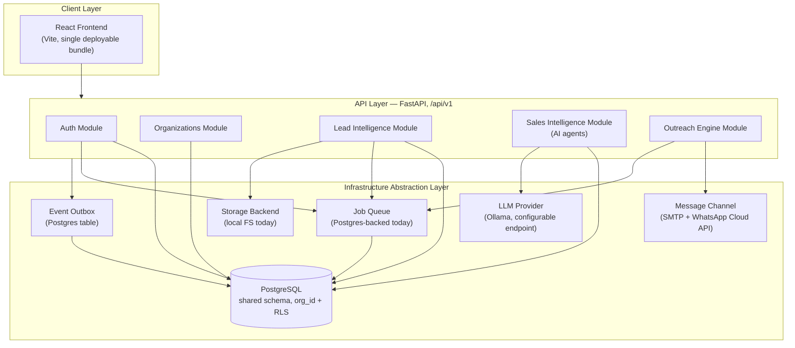

# AutoLead — Architecture Document

**Status:** Approved direction, pre-implementation
**Last updated:** 2026-08-06
**Source of truth for:** all architectural decisions from this point forward. Kept up to date as the system evolves; see `TDR.md` for the reasoning behind each decision and `ROADMAP.md` for build sequencing.

---

## 1. Vision

AutoLead is evolving from a single-user, self-hosted lead-generation tool into an **AI Marketing Operating System (AI Marketing OS)** — a platform that helps businesses discover prospects, research companies, identify decision makers, verify contacts, generate personalized outreach, automate multichannel campaigns, manage CRM and pipelines, analyze campaign performance, and continuously improve marketing through AI agents.

This document describes the architecture for the **foundation** that makes that vision buildable over time, without committing to speculative structure for capabilities that don't exist yet.

## 2. Guiding Principles

These principles govern every architectural decision in this initiative. Where a concrete decision conflicts with one of these, the principle wins unless explicitly overridden in `TDR.md`.

1. **Never break existing functionality.** The current single-user product keeps working throughout — it becomes "a deployment with exactly one tenant," not a separate code path.
2. **Backward compatible.** Every change preserves existing behavior for existing users.
3. **Every feature ships with tests.**
4. **Every migration is reversible.** Schema migrations have real `upgrade`/`downgrade` pairs. Data migrations preserve their source untouched as a rollback point.
5. **No dead code.** We do not build interfaces, modules, or abstractions for capabilities that don't exist yet. See §4.
6. **Dependencies are reviewed before architecture changes.** Every new dependency is named and justified in `TDR.md`.
7. **Technical design precedes code.** This document set is written and reviewed before any implementation sub-project starts.
8. **One subsystem at a time.** Each sub-project in `ROADMAP.md` is fully production-ready — tested, reviewed, documented — before the next one starts.
9. **YAGNI over speculative generality.** Abstractions are extracted from real, repeated implementations (the "rule of three"), not designed upfront for imagined future cases.
10. **Local-first, cloud-ready.** Everything must run entirely on a single local machine at zero cost during development, while every infrastructure-facing component sits behind an interface that can be swapped for a managed cloud equivalent later without touching business logic.

## 3. System Overview

Single deployable backend (a modular monolith), one Postgres database, one frontend bundle. No microservices, no message broker, no managed cloud dependency required to run this locally.

## 4. Architectural Style: Modular Monolith

**One deployable application, organized as independently-owned domain modules.** Each module:

- Owns its own database tables (all sharing the one Postgres database — no per-module database).
- Owns its own service layer (business logic) and its own FastAPI router.
- Is only ever called by other modules through its service layer's public functions — never by another module reaching into its models or tables directly.
- Can be extracted into its own deployable service later, if and when scale actually requires it, with the module boundary already doing most of the separation work.

This gets the benefits module boundaries exist for — independent testability, clear ownership, the ability to add capability without rewriting the platform — without paying microservices' operational cost (network calls, service discovery, distributed transactions, multiple deployments) for a product with no production scale pressure yet.

### 4.1 Active modules (built as part of this initiative)

| Module | Owns | Sub-project |
|---|---|---|
| **Auth** | users, sessions, refresh tokens, login/signup | 2 |
| **Organizations** | orgs, memberships, roles, invitations | 1, 2 |
| **Lead Intelligence** | leads, scraping sources, enrichment, scoring (existing functionality, reorganized under `org_id` scoping) | 1 |
| **Sales Intelligence** | qualification/research agents, `backend/intelligence/` (existing) | 1 (scoping only — logic already built) |
| **Outreach Engine** | campaigns, message generation/sending, WhatsApp Cloud API, follow-ups | 1, 4, 5 |
| **Platform** (cross-cutting, not user-facing) | infra abstractions (§5), job queue, event outbox, feature flags, audit log, API versioning, logging/monitoring | 3, 5–9 |

### 4.2 Reserved modules (named now, not built)

Per principle 5 (no dead code) and the explicit instruction to build only real modules: **Billing & Subscriptions, CRM, Marketing Automation, AI Agent Platform (as a standalone product surface), Integrations, Analytics, Marketplace, Public API, Enterprise Deployment** exist only as named boundaries in this document and `ROADMAP.md`. They get folders, interfaces, and code only when each becomes its own prioritized sub-project with real requirements. Reserving their names now means:

- The module map (§4.1 table) has an obvious place for each to slot into later.
- Table/column naming elsewhere (e.g., `org_id` everywhere, not `tenant_id` in some places and `account_id` in others) stays consistent with what they'll need.
- No current decision (schema, API shape, auth model) actively blocks any of them. This is checked explicitly for each in `TDR.md`.

## 5. Infrastructure Abstraction Layer

Every component that would differ between "runs on my laptop for free" and "runs on managed cloud infrastructure" sits behind a Python `Protocol` (structural interface), with one concrete local implementation today:

| Interface | Local implementation today | Future swap |
|---|---|---|
| `LLMProvider` | Ollama via configurable HTTP endpoint (already exists as `ai_brain._call_llm_raw`/`_ollama_cfg`, being formalized) | Same Ollama, moved to a dedicated GPU server — only the endpoint URL changes |
| `MessageChannel` | SMTP (existing) + WhatsApp Business Cloud API (sub-project 4) | Additional channels (SMS, LinkedIn) implement the same interface |
| `StorageBackend` | Local filesystem | S3-compatible (AWS S3 / GCS / self-hosted MinIO) |
| `JobQueue` | Postgres-backed (`SELECT ... FOR UPDATE SKIP LOCKED`) | Celery/arq + Redis, or a managed queue (SQS) |
| `EventPublisher` | Transactional outbox (Postgres table + dispatcher) | Real message broker (Kafka/SNS/EventBridge) |

No interface is built until its first concrete implementation is. The pattern (Protocol + one implementation + config-driven selection) is established once, in sub-project 3, and reused as each concrete need arises.

## 6. Multi-Tenancy

Shared Postgres database, shared schema, `org_id` column on every tenant-scoped table, enforced at two independent layers (application-level query scoping + Postgres Row-Level Security as defense-in-depth). Full design in `TENANT_ISOLATION.md`.

The existing single-user SQLite database (178+ real leads, real campaign history) becomes **tenant #1** via a one-time, reversible migration (`MIGRATION_STRATEGY.md`). The existing local single-user app keeps working unmodified in behavior — it's simply a deployment that only ever has one org.

## 7. AI Agent Architecture

`backend/intelligence/` (built in an earlier session: `AgentResult`, `EvidenceItem`, `ResearchAgent` protocol, `QualificationAgent`, `CompanyResearchAgent`, a resumable orchestrator) is the seed of the long-term AI Agent Framework, not a throwaway script set. It is grown incrementally — new shared capability (memory, tool execution, cost tracking, etc.) is extracted only once at least two or three real agents need it the same way. Full design and target capability surface in `AI_ARCHITECTURE.md`.

## 8. Event-Driven Behavior

Where modules need to react to what happened elsewhere without direct coupling (e.g., "a lead was qualified" → Outreach Engine wants to know), state changes are recorded in a Postgres `events` table in the same transaction as the change (transactional outbox pattern), and a background dispatcher delivers them to subscribers. No message broker is introduced at this stage; the dispatcher is swappable to one later without changing how modules publish or consume events.

## 9. What Does Not Change

Scraping, enrichment, scoring, message generation, and every existing frontend feature are unaffected in behavior. This entire initiative is the platform underneath the product, not a product change.

## 10. Document Set

| Document | Covers |
|---|---|
| `ARCHITECTURE.md` (this file) | System overview, principles, module map, infra abstraction |
| `ROADMAP.md` | Build sequence, milestones, active vs. reserved modules |
| `DATABASE_ERD.md` | Identity/tenancy schema, org_id augmentation of existing tables |
| `MODULE_DEPENDENCIES.md` | Module boundary and dependency diagram |
| `TENANT_ISOLATION.md` | Multi-tenancy enforcement design |
| `AUTH_RBAC.md` | Authentication and role/permission model |
| `AI_ARCHITECTURE.md` | Agent framework, current state and growth principle |
| `DEPLOYMENT.md` | 12-factor / Docker Compose / cloud-swap design |
| `MIGRATION_STRATEGY.md` | Schema and data migration approach |
| `TDR.md` | Why each major decision was made, trade-offs considered |
