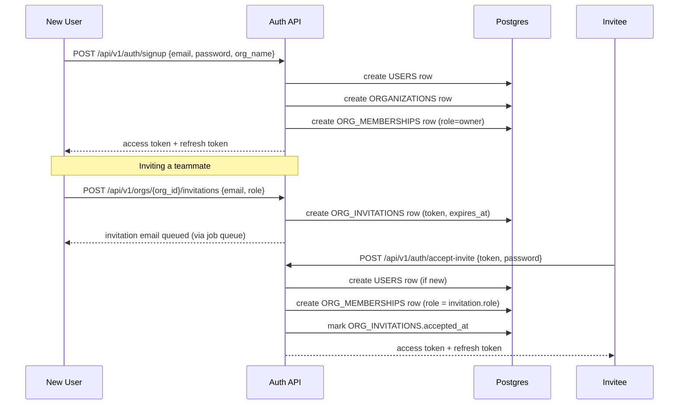

# Authentication & RBAC Design

**Companion to:** `DATABASE_ERD.md` §1 (identity tables), `TENANT_ISOLATION.md` §3 (how `org_id` reaches the request).

## 1. Authentication Model

**JWT access tokens + Postgres-backed refresh tokens.** Chosen over server-side sessions to stay stateless for the common case (verifying a request needs no database round-trip, just JWT signature/expiry checks) while keeping revocation possible (refresh tokens are real rows that can be marked `revoked_at`). See `TDR.md` for the trade-off against plain server-side sessions.

- **Access token:** short-lived (15 minutes), JWT, signed with a server secret, claims: `sub` (user id), `org_id` (active org), `role` (in that org), `exp`.
- **Refresh token:** long-lived (30 days), opaque random value, only its hash is stored (`REFRESH_TOKENS.token_hash`), presented to `/api/v1/auth/refresh` to mint a new access token. Revocable (logout, "log out other devices," admin-forced revocation) by setting `revoked_at`.
- **Password storage:** bcrypt, direct (matching the existing app's established pattern — not passlib), never plaintext, never logged.
- **A user with memberships in multiple orgs** selects an active org at login (or via a switch-org endpoint); the access token's `org_id` claim reflects the currently-active org. Switching orgs mints a new access token.

## 2. Signup / Login / Invite Flow



Signing up always creates exactly one new org with the signing-up user as `owner` — there is no "signup without an org" path, matching the model where every user belongs to at least one org.

## 3. Roles & Permissions

Three roles, foundation scope (no custom/granular permissions yet — that's an Enterprise-deployment concern, reserved per `ROADMAP.md`):

| Role | Can do |
|---|---|
| **owner** | Everything `admin` can, plus: delete the org, transfer ownership, manage billing when it exists |
| **admin** | Manage members (invite/remove/change role, except cannot remove/demote the owner), manage org settings, full access to all product features (campaigns, leads, sales intelligence) |
| **member** | Use the product: view/create/run campaigns, view leads, use sales intelligence — cannot manage org settings or members |

Permission checks are FastAPI dependencies, extending the existing `_authed` dependency pattern already used throughout `main.py`'s router registrations (e.g. `dependencies=_authed`) rather than replacing it wholesale:

```python
# Illustrative shape — exact implementation detail is a milestone-2 task, not fixed here.
def require_role(minimum: Role):
    async def _check(claims: AccessTokenClaims = Depends(get_current_claims)) -> AccessTokenClaims:
        if not role_at_least(claims.role, minimum):
            raise HTTPException(403, "Insufficient permissions")
        return claims
    return _check

router.get("/settings", dependencies=[Depends(require_role(Role.admin))])
```

## 4. Single-User Local Mode

The existing "just run `start.bat`, no setup" experience is preserved: on first run with no organizations in the database, the app auto-creates one default org and one default local user, and either skips the login screen entirely (matching today's "open API when no password is set" behavior) or auto-authenticates as that default user — exact mechanism is a milestone-2 implementation decision, but the requirement is fixed here: **zero new setup steps for the existing single-user experience.**

## 5. What This Replaces

The current single local app-password (`backend/auth.py`, bcrypt hash of one password, session tokens, router-level dependency) is replaced entirely by the model above. This is a breaking change to the *auth implementation*, not to *user-visible behavior* for the existing single-user case (§4) — satisfying principle 1/2 (never break existing functionality, backward compatible) at the behavior level while the mechanism underneath is fully rebuilt.
