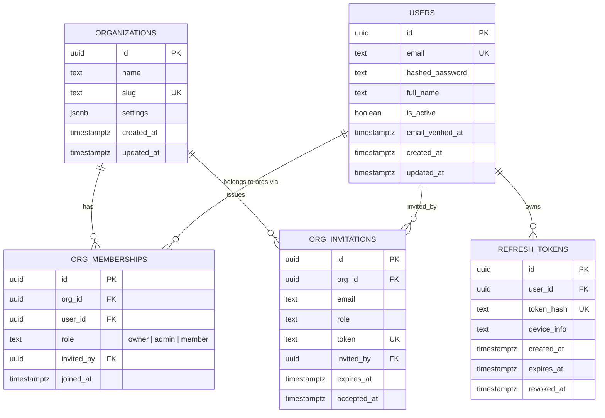
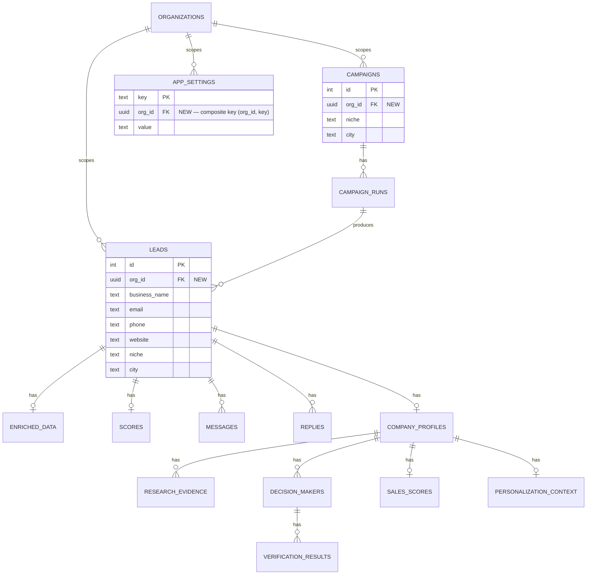

# Database ERD — Identity, Tenancy & Existing Schema

**Scope:** the schema built in Roadmap milestones 1–2 (Database & multi-tenancy foundation, Authentication). Tables for later milestones (`feature_flags`, `audit_log`, `events`) are introduced in their own milestone's design, not modeled here — see `ROADMAP.md`.

**Companion to:** `TENANT_ISOLATION.md` (how `org_id` is enforced), `AUTH_RBAC.md` (how the identity tables are used), `MIGRATION_STRATEGY.md` (how existing data becomes tenant #1).

---

## 1. New: Identity & Tenancy Schema

Notes:

- `ORG_MEMBERSHIPS` is the join table between users and orgs — a user can belong to more than one org (each with its own role), matching how real SaaS teams work. `role` is a plain text/enum column with three values today (`owner`, `admin`, `member`) — see `AUTH_RBAC.md` for what each can do. No separate `permissions` table yet; granular custom permissions are a reserved-module concern (Enterprise deployment), not built now.
- `ORG_INVITATIONS.token` is a single-use, expiring token emailed to the invitee; accepting it creates the `ORG_MEMBERSHIPS` row.
- `REFRESH_TOKENS` stores a hash of the token, never the token itself — a leaked database dump doesn't leak usable tokens. Revocation is a column update (`revoked_at`), not a delete, so revocation is auditable.
- All primary keys are UUIDs (not auto-increment integers) — this avoids leaking row counts/growth rate across tenant boundaries and is the standard choice for anything that will eventually be referenced in a public API or exposed to end users.

## 2. Existing Schema: `org_id` Augmentation

Every existing tenant-scoped table gains a required `org_id uuid` column (foreign key to `ORGANIZATIONS.id`), backfilled to the tenant created for the existing data during migration (see `MIGRATION_STRATEGY.md`), then made `NOT NULL`.

Every other existing table (`campaign_runs`, `campaign_log`, `reply_inbox`, `enriched_data`, `scores`, `messages`, `replies`, `company_profiles`, `research_evidence`, `decision_makers`, `verification_results`, `sales_scores`, `personalization_context`) gains `org_id` the same way — either directly, or (where it's cheaper and equally correct) derived transitively through its existing foreign key to `leads`/`campaigns`/`company_profiles`, whichever the table already references. The exact choice (direct column vs. derived) is a sub-project-1 implementation decision, not a design fork — direct columns are used wherever a table is queried independently of its parent (better index locality for RLS), derived is acceptable where a table is only ever accessed through its parent.

`APP_SETTINGS.key` stops being a global primary key and becomes `(org_id, key)` composite — settings are per-org from this point on (e.g., `sales_intelligence_enabled` becomes a per-org toggle, not a single global one).

## 3. Data Types & Engine Notes

- Target engine: PostgreSQL 15+.
- JSON-array columns (`_JSON_ARRAY_COLS` in current `database.py`) become native `jsonb` columns in Postgres — no more manual `json.dumps`/`json.loads` round-tripping in application code; SQLAlchemy handles this natively.
- Timestamps become `timestamptz` throughout (current SQLite schema uses naive `TIMESTAMP`) — this closes a real latent bug class (ambiguous timezone handling) as part of the migration, not as a separate task.
