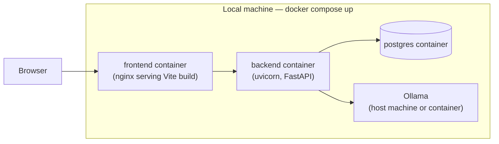
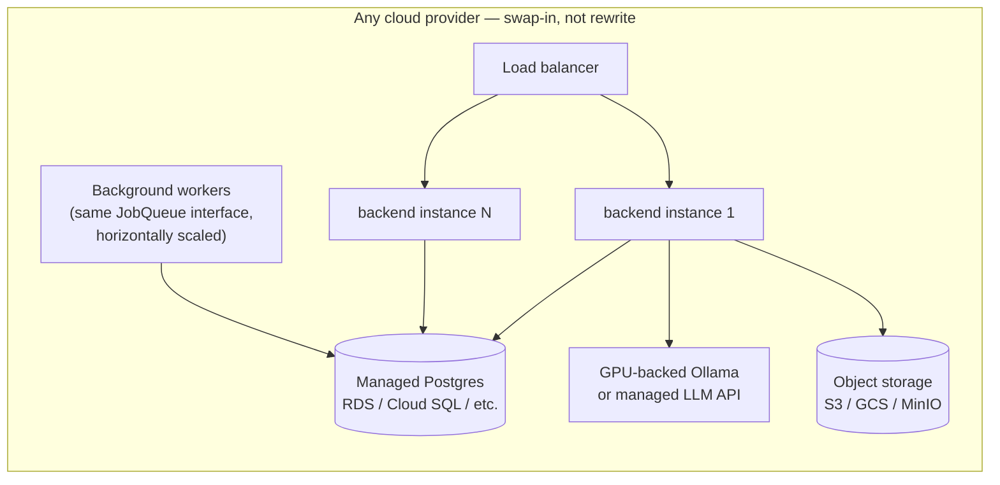

# Deployment Architecture

**Companion to:** `ARCHITECTURE.md` §5 (Infrastructure Abstraction Layer), `MIGRATION_STRATEGY.md`.

## 1. Principle: 12-Factor, Deployment-Agnostic, Local-First

No cloud provider is chosen yet — deliberately (see `TDR.md`, "deployment target: deferred"). Every decision below is made so that choice can happen later, driven by actual budget/customer needs, without a rewrite:

1. **Config in environment, not code.** All configuration (DB connection string, LLM endpoint, secrets, feature toggles) comes from environment variables, following `pydantic-settings` (already the pattern in `backend/config.py` — extended, not replaced).
2. **Stateless application processes.** The backend holds no in-memory state that would break horizontal scaling (session state lives in Postgres via refresh tokens, not in-process; job state lives in the Postgres-backed queue, not in-process).
3. **Backing services are attached resources.** Postgres, the job queue, the LLM endpoint are all reached over a connection string/URL — swapping a local Postgres container for a managed RDS instance is a config change, not a code change.
4. **Build, release, run are separate stages.** Docker images are built once, configured per-environment at deploy time (not rebuilt per environment).
5. **Dev/prod parity.** The same Docker images and the same Postgres engine run locally and in any future production environment — no "SQLite locally, Postgres in prod" divergence (that divergence is exactly what's being eliminated by this initiative).

## 2. Local Development Topology (today)

`docker-compose.yml` gains a `postgres` service (official `postgres:16` image, a named volume for data persistence, health-checked before `backend` starts). Everything runs with `docker compose up` and zero paid services, matching the existing `--profile full` pattern already in the repo.

## 3. Future Production Topology (illustrative — not committed to a provider)

Every arrow in this diagram is one of the interfaces from `ARCHITECTURE.md` §5. Moving from the local topology to this one is: point the same connection strings/URLs at managed services, and run more copies of the same stateless backend image behind a load balancer. No module's code changes.

## 4. Container Strategy

- **Multi-stage Dockerfiles** (backend and frontend already have working single-purpose Dockerfiles from prior work — milestone 10 optimizes them: separate build/runtime stages, dependency-layer caching, minimal final image size).
- **One image per module boundary is not needed** — the modular monolith (§`ARCHITECTURE.md` §4) is one backend image; module boundaries are internal, not container boundaries, until/unless a specific module is extracted into its own service later.

## 5. Milestone 10-11 Scope (Multi-Environment Config & Production Deployment)

- `docker-compose.yml` (base) + `docker-compose.override.yml` (local dev defaults) + `docker-compose.prod.yml` (production overrides: no `--reload`, resource limits, restart policies) — standard Compose layering, no new tooling.
- Environment profiles (`dev`/`staging`/`prod`) resolved via a single `ENVIRONMENT` variable read by `pydantic-settings`, changing log verbosity, debug flags, and CORS policy — never changing which code path runs.
- A generic, provider-agnostic production runbook: how to point the stack at any managed Postgres, any object storage, any container host — written once budget/provider is chosen, using the interfaces already in place.
