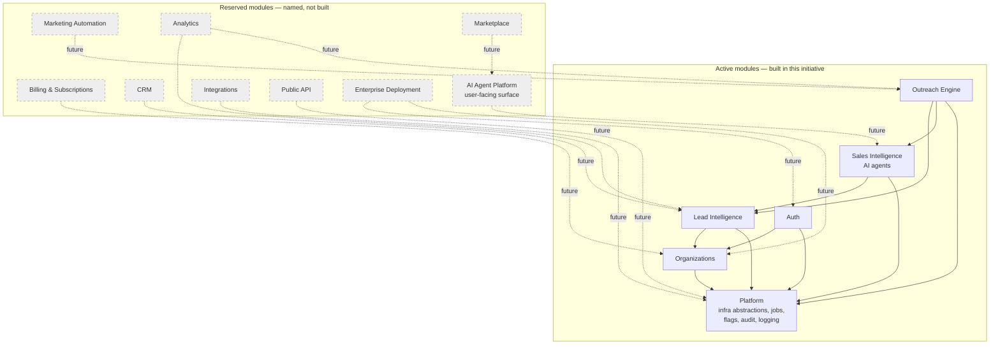

# Module Dependency Diagram

**Companion to:** `ARCHITECTURE.md` §4 (Modular Monolith). Shows which modules exist, which are reserved, and the allowed direction of calls between them.

**Rule:** a module may call another module's public service-layer functions. It may never import another module's database models or reach into its tables directly. Arrows below show allowed call direction; there are no cycles — a lower module never calls back up into a module that depends on it.

Dashed lines: the expected dependency direction *when a reserved module is eventually built* — captured now so nothing built today accidentally makes that harder, without building anything for it yet.

## Module Responsibilities

| Module | Responsibility | Depends on |
|---|---|---|
| **Organizations** | Org/tenant records, memberships, roles, invitations | Platform (DB, job queue for invite emails) |
| **Auth** | User accounts, login, JWT issuance/refresh, permission checks | Organizations (a user's role lives in a membership), Platform |
| **Lead Intelligence** | Scraping, enrichment, scoring — the existing lead pipeline, now org-scoped | Organizations (scoping), Platform |
| **Sales Intelligence** | Qualification/research AI agents (`backend/intelligence/`) | Lead Intelligence (operates on leads), Platform (LLM provider interface) |
| **Outreach Engine** | Campaigns, message generation, sending (email + WhatsApp Cloud API), follow-ups | Lead Intelligence, Sales Intelligence (research informs messaging), Platform (message channel interface, job queue) |
| **Platform** | Cross-cutting infrastructure: DB session/RLS context, job queue, event outbox, feature flags, audit log, structured logging, storage backend, LLM provider abstraction | Nothing above it — this is the foundation layer every other module sits on |

Platform is not itself a "product" module — it has no user-facing routes of its own beyond `/health`, `/metrics`, and admin endpoints for flags/audit (milestones 7-9). Every other active module depends on it; it depends on nothing above it.

## Why this shape

- **No cycles** means no module needs another module's half-finished state to function — each can be built, tested, and reviewed in the milestone order from `ROADMAP.md` without waiting on later work.
- **Platform at the bottom** is what makes the infra swaps in `ARCHITECTURE.md` §5 safe — every module talks to Postgres, the job queue, the LLM, and messaging *only* through Platform's interfaces, never directly, so swapping an implementation later touches one place, not every module.
- **Reserved modules point at existing ones, not the other way around** — when CRM eventually gets built, it will consume Lead Intelligence's public interface; Lead Intelligence will never be written to know CRM exists. This is what "avoid decisions that would require major rewrites later" (per your long-term-vision requirement) actually means in practice: dependencies point toward what's stable and already built, not toward what's speculative.
