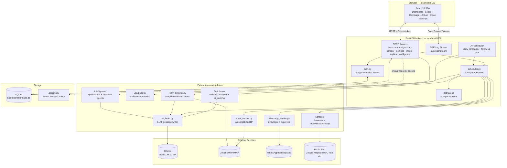
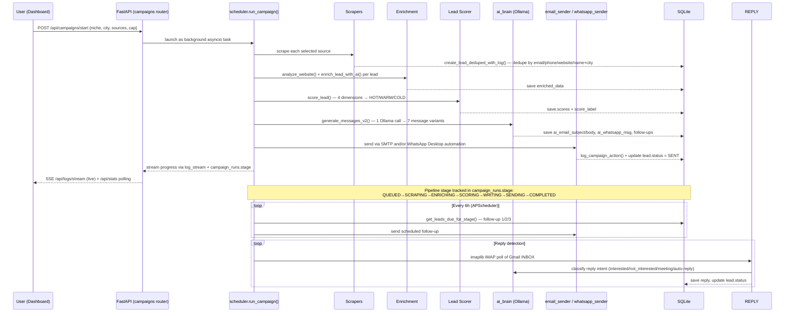
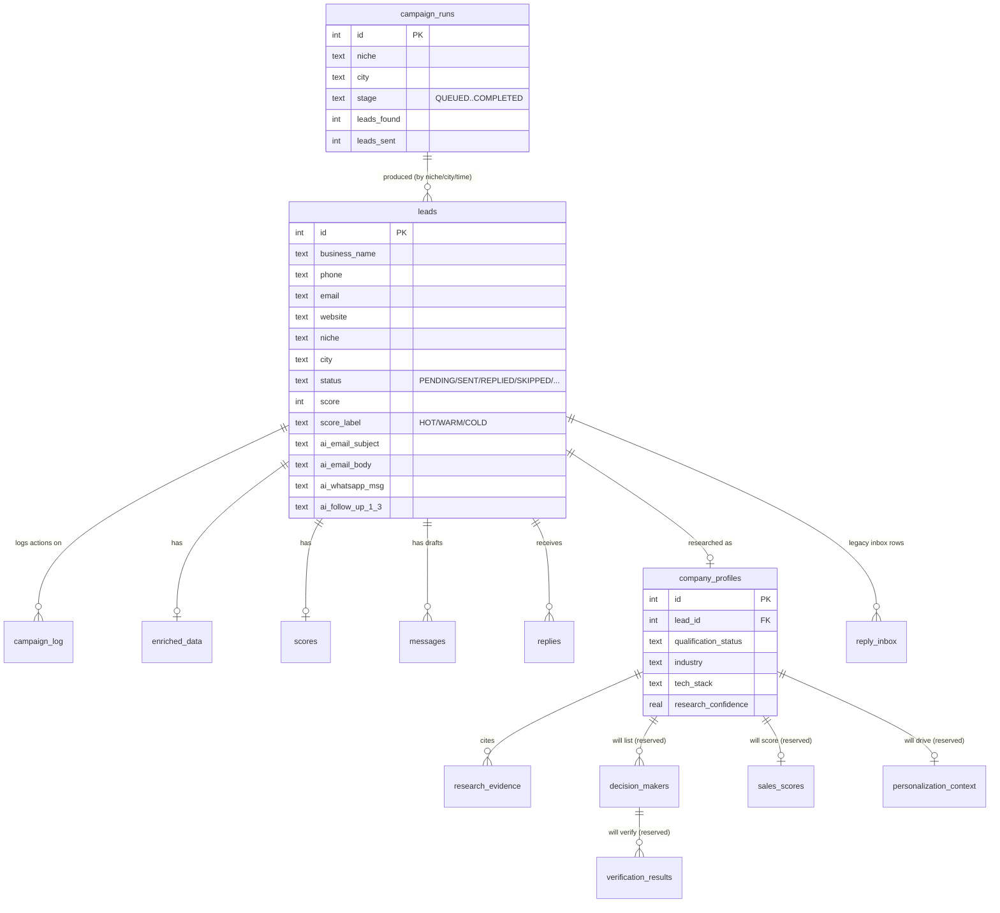

# AutoLead Marketing Engine — Full Codebase Analysis

A structural and technical breakdown of this repository as it actually runs today: folder layout, architecture diagrams, database shape, and every Python automation technique the backend uses. Written from reading the live code, not the aspirational SaaS-transformation docs in `docs/architecture/` (those describe a *planned* multi-tenant rebuild that hasn't replaced this codebase yet).

---

## 1. What this project is

AutoLead is a **self-hosted, single-user lead-generation and outreach engine**. Given a niche + city, it:

1. Scrapes local business listings from the web (Google Maps, Google/Bing search, Yelp, Yellow Pages, etc.)
2. Enriches each lead by analyzing its website
3. Scores each lead 0–100 and buckets it HOT / WARM / COLD
4. Writes personalized outreach copy with a local LLM (Ollama)
5. Sends it by Gmail SMTP or WhatsApp Desktop automation
6. Schedules follow-ups and detects replies automatically

Everything is controlled from a React dashboard talking to a FastAPI backend over REST + Server-Sent Events, backed by a single SQLite file. No external services are required to run it.

**Stack at a glance:** Python 3.11+ / FastAPI (backend) · React 18 + Vite (frontend) · SQLite via `aiosqlite` (database) · Ollama (local LLM) · Selenium + `httpx`/`BeautifulSoup` (scraping) · `pyautogui` (WhatsApp Desktop automation) · `aiosmtplib` / `imaplib` (email) · APScheduler (cron jobs) · `asyncio` (concurrency throughout).

---

## 2. Repository structure

```
AutoLead-manager-/
├── backend/                       FastAPI application (Python)
│   ├── main.py                    App factory, lifespan, CORS, SSE log stream, /api/health & /api/stats
│   ├── config.py                  pydantic-settings — reads backend/.env
│   ├── database.py                SQLite data layer (1,884 lines) — schema, migrations, all CRUD
│   ├── models.py                  Pydantic request/response schemas
│   ├── auth.py                    Single-user bcrypt auth + in-memory session tokens
│   ├── secrets_crypto.py          Fernet at-rest encryption for stored secrets
│   ├── rate_limit.py              slowapi limiter config
│   ├── validators.py              Input cleaning (email/phone/website/name normalization)
│   ├── log_stream.py              In-process queue feeding the SSE /api/logs/stream endpoint
│   ├── scraper.py                 Google Maps scraper (Selenium) + on-page email finder
│   ├── scrapers/                  One module per lead source (see §6)
│   │   ├── google_maps.py, google_search.py, bing_search.py
│   │   ├── yelp.py, yellow_pages.py, hotfrog.py, top_list.py
│   │   ├── foursquare.py, generic_directory.py
│   │   ├── email_finder.py        Deep multi-strategy email discovery
│   │   └── _shared.py             Shared HTTP/parsing helpers
│   ├── enrichment/
│   │   ├── website_analyzer.py    Fetches + structurally analyzes a lead's website
│   │   └── ai_enricher.py         Feeds signals + company DNA to the LLM
│   ├── scoring/
│   │   └── lead_scorer.py         4-dimension 0–100 HOT/WARM/COLD scoring model
│   ├── intelligence/               "Sales Intelligence" opt-in deep-research layer
│   │   ├── base.py                 Shared AgentResult/Evidence types
│   │   ├── qualification_agent.py  Free heuristic pre-filter (no LLM)
│   │   ├── company_research_agent.py  Tech-stack detection + LLM company profile
│   │   ├── techstack.py            Heuristic CMS/framework/analytics detection
│   │   └── orchestrator.py         Resumable per-lead pipeline runner
│   ├── ai_brain.py                 Central LLM dispatch (Ollama/cloud) — message generation (1,342 lines)
│   ├── outreach_domain.py          Domain rules for outreach content
│   ├── email_sender.py             SMTP send via aiosmtplib
│   ├── whatsapp_sender.py          WhatsApp Desktop UI-automation sender
│   ├── reply_detector.py           IMAP inbox polling + AI reply-intent classification
│   ├── followup_engine.py          Multi-stage follow-up sequencing
│   ├── scheduler.py                 APScheduler jobs + the full campaign runner (847 lines)
│   ├── queue_worker.py              Generic async N-worker job queue
│   ├── routers/                     One FastAPI router per resource (see §7)
│   ├── company_dna.txt              User-editable "who am I / what do I sell" prompt context
│   ├── data/                        leads.db (SQLite file) + .secret.key (Fernet key)
│   └── requirements.txt
│
├── frontend/                      React 18 + Vite dashboard (JavaScript/JSX)
│   ├── src/
│   │   ├── main.jsx, App.jsx       React Query provider, router, layout shell
│   │   ├── pages/                  Dashboard, Leads, Campaign, AILab, Inbox, Settings
│   │   ├── components/             Sidebar, Topbar, LeadTable, CampaignControls, ScoreBadge, …
│   │   ├── components/ui/          Skeleton loaders, ErrorBoundary/ErrorState, EmptyState, SortableHeader
│   │   ├── hooks/                  useDebouncedValue, useResizableColumns, useAnimatedNumber, useFocusTrap
│   │   ├── api/client.js            axios instance — bearer-token auth, SSE token helper, per-resource API objects
│   │   └── lib/badges.js
│   ├── vite.config.js              Dev-server proxy: /api → http://127.0.0.1:8000
│   └── Dockerfile / nginx.conf     Production build served by nginx
│
├── tests/                          pytest + pytest-asyncio + respx (HTTP mocking)
│   ├── intelligence/                Unit tests for qualification/research agents, orchestrator, techstack
│   ├── enrichment/
│   └── test_ai_brain_validation.py, test_outreach_domain.py, test_smoke_harness.py, …
│
├── docs/architecture/              Forward-looking SaaS-rebuild design docs (Postgres/multi-tenant) — NOT the
│                                    current running system; see docs/architecture/MIGRATION_STRATEGY.md
├── docker-compose.yml              Optional containerized run (SQLite either way — profile "full")
├── run_server.py                   Single-file uvicorn launcher (Windows-safe)
├── start.bat / start.sh            One-click setup + launch for Windows / Mac-Linux
└── README.md, about autolead.md    User-facing setup guide and product narrative
```

**Size:** 54 backend Python files (~18,300 lines), frontend `src/` ~7,200 lines of JS/JSX.

---

## 3. System architecture



---

## 4. End-to-end campaign pipeline



---

## 5. Database schema (SQLite, `backend/database.py`)



**19 tables total:** `app_settings`, `leads`, `campaign_log`, `campaign_runs`, `reply_inbox`, `enriched_data`, `scores`, `messages`, `replies`, `campaigns`, plus 6 tables reserved for the not-yet-built parts of the Sales Intelligence Engine (`company_profiles`, `research_evidence`, `decision_makers`, `verification_results`, `sales_scores`, `personalization_context`).

Migrations are handled in-process at startup (`_run_migrations` in `database.py`): idempotent `ALTER TABLE ADD COLUMN` upgrades, an index rebuild for case-insensitive email uniqueness, and a `replies` table rebuild to add `ON DELETE CASCADE` — no external migration tool (no Alembic), everything runs automatically on every boot.

---

## 6. Backend module map

| Module | Responsibility |
|---|---|
| `main.py` | FastAPI app factory, CORS, router registration, `/api/health`, `/api/stats`, SSE `/api/logs/stream` |
| `config.py` | `pydantic-settings` — one `Settings` class reads `backend/.env`, cached via `lru_cache` |
| `database.py` | All SQLite access — schema DDL, migrations, CRUD for every table, dashboard aggregate queries |
| `auth.py` | Optional single app password (bcrypt hash in `app_settings`), in-memory session tokens (12 h TTL) |
| `secrets_crypto.py` | Fernet (symmetric authenticated encryption) for SMTP/IMAP passwords & API keys at rest |
| `rate_limit.py` | `slowapi` limiter shared across routers (protects SMTP/LLM from accidental hammering) |
| `scraper.py` | Google Maps scraper (Selenium, run off the event loop via `asyncio.to_thread`) + single-page email regex finder |
| `scrapers/*` | One file per lead source — Google/Bing search, Yelp, Yellow Pages, Hotfrog, Top List, Foursquare, generic directory fallback, plus a deep multi-strategy `email_finder.py` (mailto scan, footer scan, JS de-obfuscation, WHOIS lookup) |
| `enrichment/website_analyzer.py` | Fetches a lead's site (`httpx`), parses with `BeautifulSoup`, extracts headings/CTAs/contact-forms/social links/word count; in-process TTL cache |
| `enrichment/ai_enricher.py` | Sends structural signals + company DNA to the LLM, gets back business summary / gaps / growth potential |
| `scoring/lead_scorer.py` | 4×25-point scoring (Digital Presence, Website Quality, Business Potential, Opportunity) → HOT ≥70 / WARM ≥40 / COLD <40 |
| `intelligence/` | Opt-in deeper research layer: `qualification_agent.py` (free heuristic reachability/data-completeness check), `company_research_agent.py` (heuristic tech-stack fingerprinting + LLM company profile), `orchestrator.py` (resumable per-lead pipeline, persists after each step) |
| `ai_brain.py` | Single choke point for every LLM call — model auto-detection against Ollama's `/api/tags`, JSON-schema coercion with alias fallback, thinking-block stripping, mojibake repair, retry logic |
| `email_sender.py` | Async SMTP send via `aiosmtplib` |
| `whatsapp_sender.py` | Drives the real WhatsApp Desktop app: launch/focus window (Win32 API via `ctypes`), `Ctrl+N` → paste phone via clipboard (`pyperclip`) → paste message → send, with randomized human-like delays |
| `reply_detector.py` | Polls Gmail via `imaplib` over SSL, matches replies to leads, classifies intent with a lightweight LLM prompt, updates lead status |
| `followup_engine.py` | Computes which leads are due for follow-up stage 1/2/3 and drives sending them |
| `scheduler.py` | `APScheduler` (`AsyncIOScheduler`) cron/interval jobs (daily campaign, periodic follow-up sweep) **and** the actual `run_campaign()` orchestration function that ties scraping→enrichment→scoring→writing→sending together |
| `queue_worker.py` | Generic bounded `asyncio.Queue` + N worker coroutines — used for parallelizing enrichment/research jobs without blocking the event loop |
| `routers/` | Thin FastAPI route handlers per resource — see endpoint table below |

---

## 7. REST API surface (by router)

| Router (prefix) | Key endpoints |
|---|---|
| `auth_router` (`/api/auth`) | `GET /status`, `POST /unlock`, `POST /set-password`, `POST /clear-password` — public, issues the session token itself |
| `leads` (`/api/leads`) | CRUD, `GET /export/csv`, `POST /import/csv`, `PATCH /{id}/status`, `POST /{id}/regenerate`, `POST /{id}/skip`, `POST /{id}/resend` |
| `campaigns` (`/api/campaigns`) | `POST /start`, `/stop`, `/pause`, `/resume`, `GET /history`, `POST /send/{id}`, `POST /send-followup/{id}`, `POST /bulk-send`, `GET /db-health` |
| `ai` (`/api/ai`) | `GET /status`, `POST /generate`, `POST /generate-bulk`, `POST /test-prompt`, `POST /test` |
| `scraper_router` (`/api/scraper`) | `POST /search`, `GET /status` |
| `settings_router` (`/api/settings`) | `GET/PUT` settings, `PUT /bulk`, `POST /test-smtp`, `GET/PUT /dna` (company DNA text) |
| `inbox` (`/api`) | `GET /inbox`, `/inbox/stats`, `/inbox/summary`, `POST /inbox/check`, plus `GET /leads/{id}/enrichment`, `POST /leads/{id}/enrich[-sync]`, `POST /leads/score-all`, `GET /leads/hot`, `/leads/outreach-queue` |
| `followups` (`/api/followups`) | `GET /pending`, `GET /history`, `POST /run` |
| `replies` (`/api/replies`) | `GET ""`, `/summary`, `POST /check`, `GET /drafts`, `PUT /{id}/draft`, `POST /{id}/approve`, `POST /{id}/discard` (AI-drafted reply approval flow) |
| `status` (`/api/status`) | `GET /status`, `POST /run-now` (scheduler status / manual trigger) |
| `intelligence` (`/api/leads`) | `GET /{id}/research` — qualification verdict + research profile + evidence trail |

Every router except `/api/health` and `/api/auth/*` is gated behind `Depends(auth.require_session)`.

---

## 8. Frontend structure

- **Routing:** `react-router-dom` v6, all pages lazy-loaded (`React.lazy` + `Suspense`) and wrapped in a route-keyed `ErrorBoundary` so a crash on one page doesn't stick around after navigating away.
- **Data fetching:** `@tanstack/react-query` for server state (polling, caching, background refetch) + a shared `axios` client (`api/client.js`) that attaches the bearer session token to every request and redirects to the lock screen on 401.
- **Live updates:** native `EventSource` against `/api/logs/stream`, authenticated via a `?token=` query param (EventSource can't set headers).
- **Large tables:** `@tanstack/react-virtual` virtualizes the Leads table for smooth scrolling over hundreds of rows; `useResizableColumns` / `useDebouncedValue` custom hooks support the filter UI.
- **Styling:** Tailwind CSS, dark theme.
- **Charts:** `recharts` (weekly activity, lead distribution).
- **Pages:** Dashboard, Leads, Campaign ("Mission Control"), AI Lab (message-generation playground), Inbox, Settings.
- **Build/dev:** Vite dev server proxies `/api/*` to `http://127.0.0.1:8000` in dev; production build served by nginx in the Docker image.

---

## 9. Python automation techniques used (the "how")

This is the part that actually answers *what kind of automation* the backend does — five distinct categories:

### a) Web scraping automation
- **Selenium + `webdriver-manager`** (`scraper.py`, `scrapers/google_maps.py`) drives a real Chrome browser to scroll and read Google Maps' results feed and business detail panel — necessary because Maps is a JS-rendered SPA with no public free API for this use case. Runs inside `asyncio.to_thread()` so Selenium's synchronous calls never block FastAPI's event loop.
- **`httpx` + `requests` + `BeautifulSoup4` + `lxml`** power the plain-HTML sources (Google/Bing search result scraping, Yelp, Yellow Pages, Hotfrog, Top List, Foursquare, generic directories) and the website-content fetch used by enrichment.
- **`fake-useragent`** rotates request headers; random `asyncio.sleep` jitter between requests throttles scrape rate to avoid detection/blocking.
- **Multi-strategy email discovery** (`scrapers/email_finder.py`): mailto-link scan → footer text scan → JavaScript de-obfuscation (sites that hide emails behind JS to beat scrapers) → WHOIS registrant lookup (`python-whois`) as a last resort.
- **Graceful degradation:** Selenium import is wrapped in a `try/except ImportError` at module load, so the app still starts (with reduced scraping capability) if Chrome/Selenium isn't available.

### b) Desktop UI automation (WhatsApp)
- **`pyautogui` + `pyperclip` + `ctypes` (Win32 API)** in `whatsapp_sender.py` drive the actual installed WhatsApp Desktop application — not the paid WhatsApp Business Cloud API. It launches/focuses the app window by searching Win32 window handles, opens a new chat with `Ctrl+N`, pastes the phone number and message via the clipboard (avoids typing-speed/unicode issues), and sends with `Enter`. Random 2–4 s delays between steps mimic human pacing.
- An `asyncio.Lock` serializes every WhatsApp send, since `pyautogui` controls the one shared desktop — two sends can't run concurrently without fighting over the same mouse/keyboard.

### c) AI / LLM automation
- **`ollama` Python client** talks to a locally-running Ollama server (default model `llama3.1:8b`) for every generative step: enrichment summaries, HOT/WARM/COLD-informing content signals, 7-message outreach generation in a single call, and reply-intent classification.
- **`ai_brain.py`** is the one choke point all of this goes through: it auto-detects which model is actually available via Ollama's `/api/tags`, retries failed generations (`MAX_RETRIES = 3`), strips `<think>` reasoning blocks some models emit, repairs common mojibake encoding issues, and coerces the model's free-form JSON into a strict schema using per-field alias lists (since LLMs don't reliably use the exact key names you ask for).
- Optional cloud LLM fallback (OpenAI/Anthropic-compatible) can be configured, but Ollama is the default so the app works fully offline.

### d) Email automation
- **`aiosmtplib`** sends outreach and follow-up emails asynchronously over Gmail SMTP (requires a Gmail App Password, not the account password).
- **`imaplib`** (`reply_detector.py`) polls the Gmail inbox over IMAP-SSL for unseen mail, matches each message back to a lead by sender address or business name in the subject line, and feeds the body through the LLM for intent classification (interested / not interested / meeting request / auto-reply) — fully automated inbox triage.

### e) Scheduling & concurrency automation
- **APScheduler** (`AsyncIOScheduler`, cron + interval triggers) runs the daily campaign job and a periodic follow-up sweep entirely in-process — no external cron/Celery/task broker.
- **Custom async job queue** (`queue_worker.py`) — a bounded `asyncio.Queue` with N worker coroutines — parallelizes enrichment/research work without a separate task-queue service (no Redis/Celery).
- **Server-Sent Events** (`main.py`'s `/api/logs/stream`) stream live campaign progress to the browser by merging two sources (a DB table poll + an in-memory log queue) every 2 seconds — a lightweight real-time channel with no WebSocket infrastructure.

### f) Security automation
- **`bcrypt`** hashes the single optional app password; session tokens are opaque, in-memory, and expire after 12 hours.
- **`cryptography` (Fernet)** encrypts SMTP/IMAP passwords and API keys at rest in the settings table, with a key auto-generated into `backend/data/.secret.key` on first use — falls back to (flagged) plaintext storage if the package isn't installed, rather than crashing.
- **`slowapi`** rate-limits campaign-start and AI-generation endpoints to protect the user's own SMTP account and local LLM from accidental self-hammering.

---

## 10. Testing

`pytest` + `pytest-asyncio` + `respx` (HTTP call mocking for `httpx`). Coverage focuses on the newer, riskier subsystems: the Sales Intelligence agents (`qualification_agent`, `company_research_agent`, `orchestrator`, `techstack` detection), the website-analyzer's raw-HTML edge cases, AI output validation (`ai_brain` JSON coercion), outreach-domain rules, and a smoke-test harness for the app as a whole.

---

## 11. Known limitations (as-is, not hypothetical)

- WhatsApp sending requires WhatsApp Desktop to be installed, running, and logged in — it's UI automation, not an official API, so it's Windows-centric and can break if WhatsApp changes its UI.
- Email sending/reply-detection need a real Gmail App Password configured in Settings — ships with placeholder values.
- Secrets fall back to plaintext at rest if `cryptography` isn't installed (logged warning, not silent).
- `backend/.env` still carries unused `DATABASE_URL` (Postgres) / `REDIS_URL` entries left over from an earlier exploration — neither `config.py` nor `database.py` reads them; the app runs on SQLite only, full stop.
- The forward-looking multi-tenant/Postgres SaaS architecture described in `docs/architecture/` is a design/migration plan, not the current running system.

---

*Generated by analyzing the live codebase (backend `.py` files, `frontend/src`, `database.py` schema, and router source) — reflects the code as it stands, not aspirational docs.*
